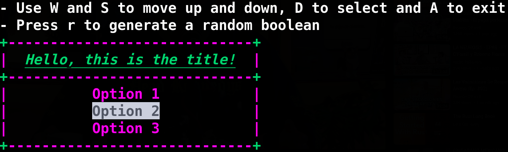

# rsmenuu

## Create menus easily on your terminal using Rust

### Installation

Add to the dependencies section of your Cargo.toml file:

```toml
rsmenuu = { git = "https://github.com/ErickDevv/rsmenuu" }
```

### **Example of use:**

#### *Code:*


```rust
use rsmenuu::create_menu;
use rsmenuu::MenuResult;

fn main() {
    let options: Vec<&str> = vec!["Option 1", "Option 2", "Option 3"];
    let keys: Vec<char> = vec!['h'];
    let menu: MenuResult = create_menu("Title", options, keys);
    println!("Selected: {}", menu.index);
}
```
#### *Output:*

